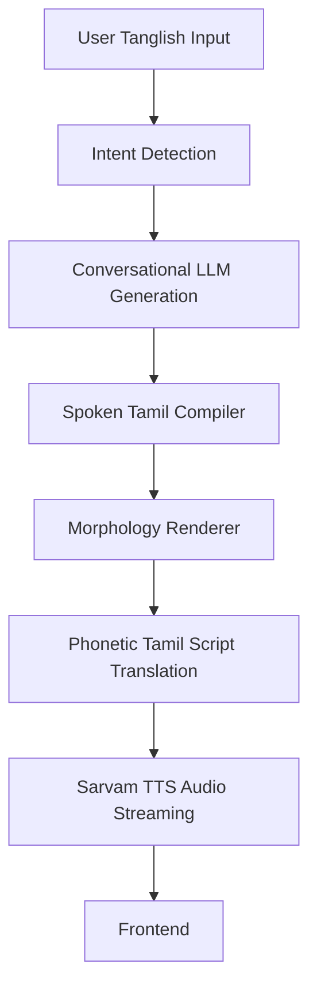

<div align="center">

# Tamilvox 
### Conversational Tamil Rendering Pipeline

[](https://opensource.org/licenses/MIT)
[](https://fastapi.tiangolo.com/)
[](https://nextjs.org/)
[](https://threejs.org/)
[](https://sarvam.ai/)

*Tamil that sounds human.*

</div>

<br/>

**Tamilvox is a cinematic conversational speech rendering system that transforms raw Tanglish input into emotionally believable Tamil speech.** 

It is not a chatbot. It is a **spoken Tamil rendering architecture** designed to bridge the uncanny valley between formal text generation and how humans actually speak in the real world.

---

## 🎭 Why Tamilvox Exists

Conversational Tamil TTS is a notoriously difficult problem. Existing LLM-to-TTS pipelines fundamentally fail when generating casual Tamil because:

1. **Formal Tamil Bias:** Standard LLMs tend to generate formal, literary Tamil script (*Senthamizh*), which sounds incredibly robotic and out-of-place when spoken aloud.
2. **The Tanglish Problem:** Real-world Tamil speakers aggressively mix English nouns with Tamil verbs and suffixes (Tanglish). If an LLM generates pure Tanglish, most native Tamil TTS engines mispronounce the English characters using broken phonetics.
3. **Loss of Rhythm:** Humans compress their words. We don't say *"eppadi mudiyuthu"* (how is it possible)—we say *"epdi mudiyuthu"*. Standard text-to-speech engines lack this morphological compression.

**Tamilvox fixes this.** It acts as a middleware compiler—translating human conversational intent into a hyper-compressed, phonetically stable script that forces the TTS engine to sound organic, emotional, and undeniably human.

---

## 🎧 The Difference

By intercepting the generation layer, Tamilvox alters the morphological structure before it ever reaches the audio synthesizer.

| Input Intent | Raw LLM + TTS Pipeline | Tamilvox Pipeline |
| :--- | :--- | :--- |
| `"phone charge illa da"` | "என்னுடைய தொலைபேசியில் மின்சாரம் இல்லை." | *"ம்ம்... charge பண்ணி வச்சிருக்கேன்..."* |
| `"padikka ukkandha udane thookam vandhuruchu"` | "நான் படிக்க அமர்ந்தவுடன் எனக்கு உறக்கம் வந்துவிட்டது." | *"ஆன்... உடனே தூக்கம் வந்துருச்சு..."* |
| `"dei sema mokka da"` | "நண்பரே, இது மிகவும் சலிப்பாக இருக்கிறது." | *"அட டேய்... செம மொக்க தான்..."* |

<br/>

<div align="center">
  
  <p><em>Experience the cinematic audio-reactive UI in Demo Mode.</em></p>
</div>

---

## ✨ Features

* **Conversational Tamil Rendering:** Generates WhatsApp voice-note style colloquial speech.
* **Spoken Tamil Compiler:** Dual-renders Tanglish into optimized TTS and Display formats.
* **Morphology-Aware Normalization:** Compresses rigid verbs (*"pannukiren"*) into spoken fluid verbs (*"panren"*).
* **Phonetic TTS Pipeline:** Maps phonetic Tanglish precisely to Tamil script so the Sarvam AI TTS engine pronounces it flawlessly.
* **Emotion-Aware Pacing:** Dynamically adjusts audio playback speed (pace) based on inferred emotional state (e.g., *sighing*, *playful*, *outraged*).
* **Cinematic AI Voice UI:** A state-of-the-art WebGL audio-reactive orb interface built with Three.js and custom GLSL shaders.

---

## 🧠 Architecture

Tamilvox operates as a multi-stage compilation pipeline.



### 1. Intent Detection
Before generating dialogue, a high-speed LLM pass classifies the raw string into core social intents (e.g., `wellbeing_check`, `stress`, `casual_opinion`). This conditions the conversational momentum.

### 2. Conversational Generation (Groq)
Powered by Llama-3 (via Groq), the system generates a pure Tanglish response strictly avoiding formal Tamil patterns. It injects conversational fillers (`"mmm..."`, `"aan..."`) and internet slang naturally.

### 3. The Compiler & Renderer Stage
The `core/renderer.py` intercepts the Tanglish output. It normalizes grammar variations (`ila` -> `illa`), compresses morphology (`-achu`, `pannalam`), and selectively translates Tamil verbs/adjectives into native Tamil script, while strategically leaving English nouns untouched.

### 4. Streaming TTS via Sarvam
The compiled hybrid text is sent to the Sarvam API (`bulbul:v3`). The exact pace is dynamically calculated from the emotional tag injected by the LLM. Audio is streamed back to the client as Base64 encoded WAV buffers.

---

## 🚀 Quick Start

### Prerequisites
* Node.js v18+
* Python 3.10+
* Groq API Key
* Sarvam AI API Key

### 1. Backend Setup
Clone the repository and install the Python dependencies:

```bash
git clone https://github.com/riit3sh/tamil-vox.git
cd tamil-vox
python -m venv .venv
source .venv/bin/activate  # Or `.venv\Scripts\activate` on Windows
pip install -r requirements.txt
```

Create a `.env` file in the root directory:
```env
GROQ_API_KEY=your_groq_api_key
SARVAM_API_KEY_KAVITHA=your_sarvam_api_key
```

Start the FastAPI server:
```bash
uvicorn api:app --reload
# Runs on http://localhost:8000
```

### 2. Frontend Setup
Open a new terminal and start the Next.js frontend:

```bash
cd frontend
npm install
npm run dev
# Runs on http://localhost:3000
```

---

## 🕹️ How to Use

1. Navigate to `http://localhost:3000`.
2. Type a Tanglish prompt into the floating Voice Console (e.g., *"epdi irukka?"* or *"cinema pathi pesu"*).
3. Hit enter. Watch the orb transition into its **listening** state.
4. Listen as the system compiles the morphology and streams the **speaking** state audio back to your browser in real-time.
5. Scroll down to the **Demo Section** to compare raw TTS capabilities vs the Tamilvox rendering pipeline using pre-compiled audio samples.

---

## 📂 Project Structure

```text
tamilvox/
├── api.py                    # FastAPI server entrypoint
├── core/                     
│   ├── persona_state.py      # Stateful conversation momentum tracker
│   └── renderer.py           # Spoken Tamil Compiler & morphology rules
├── data/
│   └── colloquial_tamil_generation_library.md  # Internal context library
├── frontend/                 # Next.js Application
│   ├── src/
│   │   ├── app/page.tsx      # Main cinematic layout & API fetch logic
│   │   └── components/       
│   │       ├── Orb.tsx       # Three.js / GLSL Shader visualizer
│   │       ├── VoiceConsole.tsx 
│   │       └── DemoSection.tsx
│   └── public/audio/         # Compiled comparison audio assets
├── profiles/
│   └── kavitha.json          # System prompts, LLM constraints, TTS configs
├── tts/
│   └── sarvam.py             # Sarvam AI API client & Base64 audio streaming
└── requirements.txt
```

---

## 🛠️ Tech Stack

* **Frontend:** Next.js 14, Tailwind CSS, Framer Motion, Lucide Icons
* **WebGL:** Three.js, React Three Fiber, Custom GLSL Shaders
* **Backend:** Python 3.12, FastAPI, Uvicorn, Pydantic
* **AI & TTS:** Groq (Llama-3-70b-versatile), Sarvam AI (bulbul:v3)

---

## 🗺️ Future Roadmap

* [ ] **Realtime Voice Mode:** Integrate WebRTC for sub-500ms voice-to-voice interaction.
* [ ] **Streaming TTS Chunking:** Stream audio bytes as they are generated rather than waiting for the full WAV buffer.
* [ ] **Emotion Conditioning Pipeline:** Deepen the emotional state machine to alter pitch and volume.
* [ ] **Multilingual Rendering:** Apply the exact same morphology engine to conversational Telugu and Malayalam.
* [ ] **Subtitle Integration:** Sync the `display_text` generated by the compiler with the frontend audio playback.

---

## 💡 Philosophy

Tamilvox is **NOT** trying to generate perfect literary Tamil. 

It is trying to generate **emotionally believable conversational speech**. In the real world, human language is messy. We compress syllables, mix languages, breathe heavily, and skip grammar rules. This project is an architectural exploration of how to forcefully inject those beautiful human imperfections back into artificial intelligence.

---

## 🤝 Contributing

We welcome contributions! Whether it is adding new morphology patterns to `renderer.py`, improving the WebGL orb shaders, or adding new Persona profiles, feel free to open a Pull Request.

---

## 📄 License

This project is licensed under the MIT License - see the [LICENSE](LICENSE) file for details.
